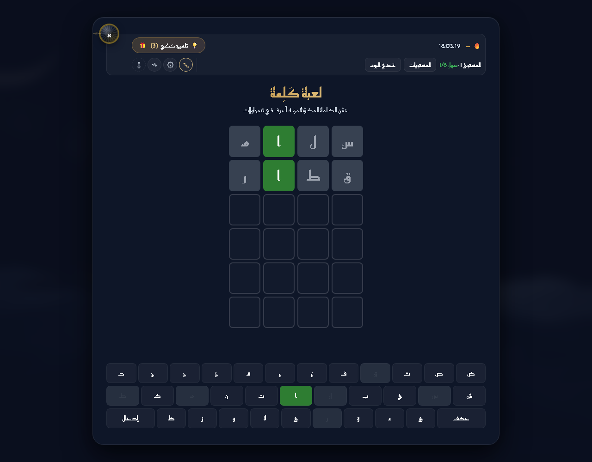
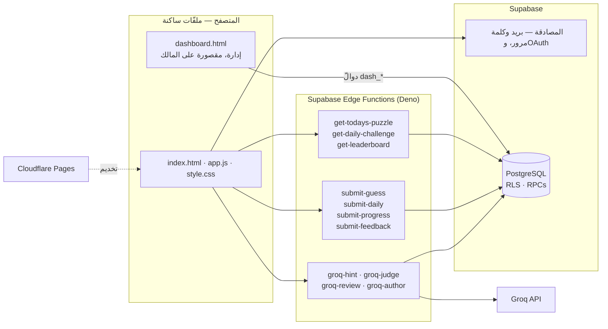
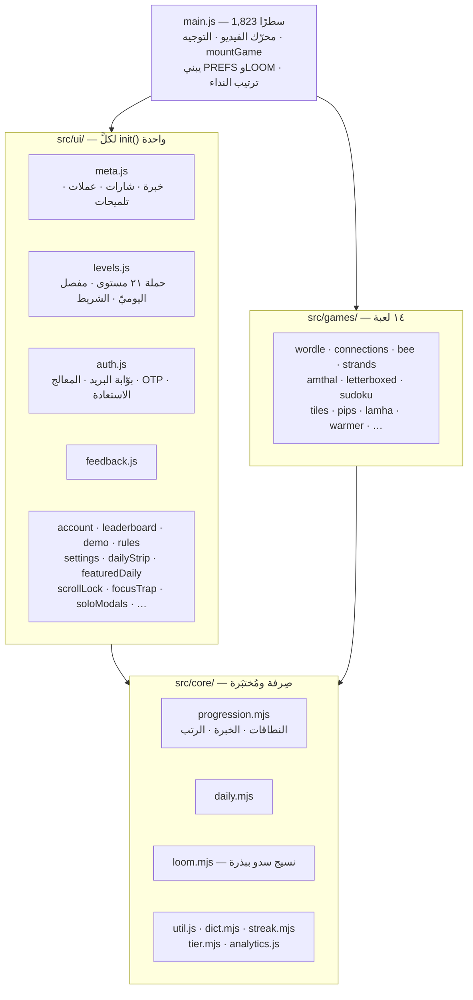
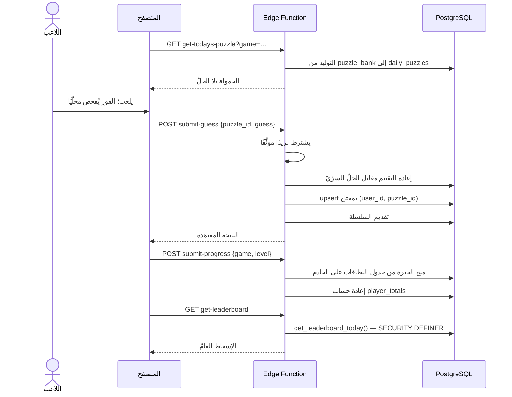
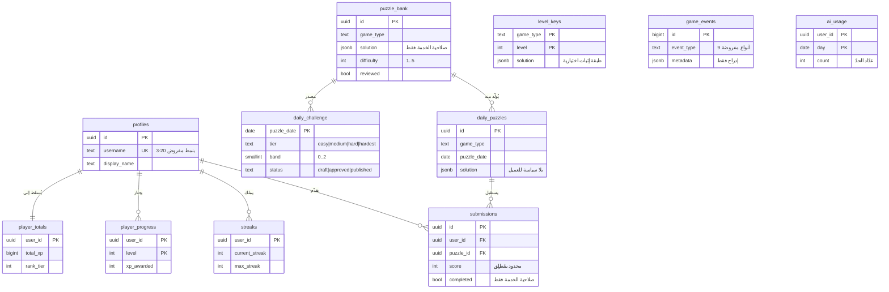

<div dir="rtl">

# سُرى / Sura

**[suraio.com](https://suraio.com)** · [English](README.md)

منصّةُ ألعابٍ ذهنيّةٍ عربيّةٍ يوميّة: ستُّ ألعابٍ حيّة، وحملةٌ من ٢١ مستوى،
وتحدٍّ يوميٌّ متدرّجٌ بأيّام الأسبوع، وسلاسل، ولوحةُ صدارةٍ سلطتُها على الخادم،
وتلميحاتٌ بالذكاء الاصطناعيّ، ولوحةُ تحليلاتٍ للإدارة.

عربيٌّ بالكامل من اليمين إلى اليسار، بلا إطارِ عمل، وبلا خطوةِ بناءٍ في المتصفّح.


| | |
|---|---|
|  |  |

---

## التقنيّات

| الطبقة | التقنيّة | ملاحظة |
|---|---|---|
| **الواجهة** | JavaScript صِرف (وحدات ES) وHTML وCSS | بلا إطارِ عمل. و`src/` هي `core/` و`games/` و`ui/`، تُحزَم في `IIFE` واحدة. |
| | **esbuild** | `src/main.js` ← `app.js` مُصغَّرة. الحزمةُ مُودَعة، وCI يفشل عند أيّ انحراف. |
| | **GSAP + ScrollTrigger** | حركةُ الكاميرا والبطاقات مع التمرير. |
| | **lottie-web** | يُحمَّل كسولًا، حيث تُستعمل حركةٌ متّجهةٌ فقط. |
| | **Canvas 2D** | نسيجُ السدو الإجرائيّ في الخلفيّة، يُولَّد يوميًّا من بذرة. |
| **الخلفيّة** | **Supabase Edge Functions** (Deno / TypeScript) | إحدى عشرة دالّة. كلُّ كتابةِ نتيجةٍ وكلُّ قراءةِ لغزٍ تمرّ بها. |
| | **Groq** — `llama-3.3-70b-versatile` | التلميحات ومراجعةُ المحتوى وتصنيفُ الصعوبة واقتراحُ البنوك. لا يؤلّف مستوًى وقتَ اللعب أبدًا. |
| | **Resend** | بريدُ المصادقة (التحقّق والاستعادة). |
| | **Node.js ≥ 20** | بوت التشغيل على Telegram (صلاحيّةُ خدمة، غير منشور — انظر أدناه). |
| **قاعدة البيانات** | **PostgreSQL** على Supabase | **RLS مفعَّلٌ على كلِّ جدول، بلا استثناء**. |
| | أمنُ الصفوف (RLS) | هو طبقةُ التخويل. لا الواجهة، ولا إخفاءُ المفتاح. |
| | دوالُّ `SECURITY DEFINER` | إسقاطُ لوحة الصدارة، وتحليلاتُ الإدارة، وحجزُ اسم المستخدم، وعدّادُ حدّ الذكاء الاصطناعيّ. |
| **البنية التحتيّة** | **Cloudflare Pages** | نشرٌ ساكنٌ من قائمةٍ صريحة. |
| | **Cloudinary** | توصيلُ الفيديو بـ`f_auto/q_auto`. |
| | CSP وHSTS عبر `_headers` مولَّدة | بصماتُ SHA-256 تُحسب من النصوص المضمَّنة الفعليّة وقتَ البناء. |
| **الأدوات** | `node:test` | ٤٥٠ اختبارًا في ٣٥ ملفًّا، **بلا تنصيب** — مُشغِّل Node المدمج. |
| | **Playwright** | جولةُ لعبٍ آليّةٍ كاملة، ومِرقابُ بصمةٍ سلوكيّة. |
| | **GitHub Actions** | تكاملٌ مستمرّ (انحرافُ الحزمة، الفحص، الاختبارات) ومراقبُ توفّر. |

---

## البنية

</div>



<div dir="rtl">

**حدُّ الثقة.** العميلُ غيرُ موثوقٍ في النتائج البتّة. `submit-guess` يعيد تقييم
كلّ تخمينٍ على الخادم مقابل الحلّ السرّيّ، و`submit-progress` يمنح الخبرةَ من
جدول النطاقات عنده لا من رقمٍ أرسله العميل. ومفتاحُ `anon` عامٌّ بالتصميم —
الحمايةُ من RLS.

---

## بنية الوحدات

كان `src/main.js` ٧٬٢٤١ سطرًا داخل `DOMContentLoaded` واحدةٍ بلا سطحٍ يمكن
استيرادُه. صار ١٬٨٢٣ سطرًا، وخرجت منه ٢٢ وحدة.

</div>



<div dir="rtl">

قاعدتان يتبعهما التفكيك: **الحالةُ تُمرَّر والبياناتُ تُستورَد** (`PREFS`
و`LOOM` كائنان حيّان واحدان، فاستيرادُ مصنعيهما يبني نسخةً ثانيةً لا تُزامَن)،
و**ترتيبُ النداء عقدٌ** — `meta.js` يسجّل ما يقرؤه كلُّ ما بعده تقريبًا.

---

## جولةُ لعب

</div>



<div dir="rtl">

اللاعبُ المجهول لا يرسل شيئًا؛ يُعرض عليه التسجيل، ويُرحَّل تقدّمُه المحلّيّ عند
أوّل دخول.

---

## نموذج البيانات

</div>



<div dir="rtl">

`submissions` فريدةٌ على `(user_id, puzzle_id)` و`player_progress` على
`(user_id, game_type, level)` — والمفتاحان يعملان مفتاحَي تكرارٍ أيضًا، فإعادةُ
إرسالٍ لا تُضاعف الرصيد.

التفصيل: [`docs/architecture/database.md`](docs/architecture/database.md).

---

## أبرزُ ما بُني

**بصمةٌ سلوكيّةٌ لإعادة هيكلةٍ بلا اختبارات.**
كان في `src/main.js` ٧٬٢٤١ سطرًا لا يستطيع أحدٌ استيرادَها، فلا يستطيع أحدٌ
اختبارَها. وبدل الاتّكال على قراءةٍ متأنّية، يقود `scripts/qa/fingerprint.js`
متصفّحَ Chromium على الموقع العامل ويسجّل سلوكًا حقيقيًّا — أصنافَ DOM، وحالةَ
ARIA، والتركيز، وقفلَ التمرير، وحسابَ الخبرة، وأخطاءَ الطرفيّة — ثمّ يقارنه قبل
التغيير وبعده. جرى التفكيك في **عشر دفعاتٍ على ٢٢ وحدةً بلا أيّ انحرافٍ سلوكيّ**،
والانحدارُ الوحيد الذي وقع (`escapeHtmlShared is not defined`) أمسكه المِرقاب لا
الاختبارات: كلُّها تقرأ نصَّ المصدر، ولا يرى الاسمَ خارجَ نطاقه إلّا متصفّح.

**إغلاقُ ثغرة تزوير لوحة الصدارة.** كان على `submissions` سياستا `INSERT`
و`UPDATE` للعميل مشروطتين بـ`auth.uid() = user_id` وحده، ومُطلِقُ السلامة لا
يتحقّق من `score` ولا `completed`. فكان بوسع أيّ مستخدمٍ مسجَّلٍ أن يرسل مباشرةً
إلى `/rest/v1/submissions` متجاوزًا `submit-guess` ويكتب نتيجةً كاملةً في صدر
اللوحة. أُسقطت السياستان وشُدِّد المُطلِق؛ وصارت كتابةُ النتائج عبر صلاحيّة
الخدمة وحدها. ولأنّ العميل لم يكن يفعل بهذه الجداول غيرَ القراءة، شُحن الإصلاح
بلا أثرٍ عليه.

**تقدّمٌ سلطتُه على الخادم.** `submit-progress` يشتقّ الخبرةَ من جدول النطاقات
عنده، ويفرض بوّابةً تصاعديّة، ولا يتكرّر أثرُه على مفتاحه الأساسيّ، ويداوي
`player_totals` من `player_progress`.

**حرّاسُ بناءٍ لا أعرافٌ متّبعة.** `scripts/build/dist.js` يجمّع مجلّدَ النشر من
قائمةٍ صريحة، ويرفض تسعَ امتدادات، ويفشل عند أيّ ملفٍّ شارد، ويمسح الناتجَ بحثًا
عن أسرار — فما ليس في القائمة لا يُشحن أينما سكن. و`scripts/build/csp.js` يحسب
بصماتِ CSP من النصوص المضمَّنة الفعليّة. و`scripts/build/preflight.js` يعيد كتابة
كلّ `?v=` من بصمةِ محتوى، فلا يُضبط كسرُ التخزين باليد.

**اختباراتٌ أُريَت تفشل قبل أن تُصدَّق.** ٤٥٠ اختبارًا على مُشغِّل Node المدمج،
بلا خطوةِ تنصيب. وحيث يحرس الحارسُ شيئًا غاليًا — وحدةَ الدخول، أو الموقفَ
الأمنيّ — حُوِّر الادّعاءُ في المصدر ورُئي يحمرّ قبل أن يُعتمد.

**طبقةٌ لغويّةٌ عربيّةٌ تعمل دون اتّصال.** `normalizeArabic` يطوي التشكيلَ وصورَ
الألف والياء والهمزة، وله ثلاث تنفيذاتٍ — JS وDeno ودالّة Postgres — يثبّتها
اختبارٌ على مواصفةٍ واحدة، لأنّ انحرافَها يعني تقييمَ التخمين الواحد تقييمين.

---

## الأوامر

</div>

```bash
npm run build        # esbuild ← app.js + tallal.js، ثم preflight، ثم CSP
npm run dist         # بناء، ثم تجميع dist/ من قائمة صريحة
npm test             # ٤٥٠ اختبارًا في ٣٥ ملفًّا
npm run lint         # node --check على ١٥٨ ملفًّا
npm run sweep        # جولة لعب آليّة: ٢١ مستوى × ٦ ألعاب
npm run fingerprint  # البصمة السلوكيّة — انظر docs/decisions/0011
npm run publish:tree # تجميع شجرة المستودع العامّ، بحرّاسها
```

<div dir="rtl">

---

## خريطة المستودع

| المسار | ما هو |
|---|---|
| `index.html` · `app.js` · `style.css` | التطبيق. و`app.js` ناتجُ بناءٍ مُودَع — يُعدَّل `src/`. |
| `src/core/` | منطقٌ صِرفٌ قابلٌ للاستيراد ومُختبَر. |
| `src/games/` | ١٣ لعبة. |
| `src/ui/` | وحداتُ واجهةٍ عرضيّة، لكلٍّ `init()` واحدة. |
| `supabase/functions/` | الدوالُّ الحَديّة — مرجعُ الحقيقة. |
| `supabase/migrations/` · `supabase/sql/` | المخطّط وRLS والدوالّ. ليسا متبادلين. |
| `scripts/` | `build/` `bank/` `assets/` `qa/` `promo/`. |
| `tests/` | ٣٥ ملفًّا مسطَّحة — [`tests/README.md`](tests/README.md). |
| `bank/` | محتوى الألغاز (JSON). |

### ما لا يُنشر هنا

محجوبٌ عمدًا، ومُسمًّى لا غائبٌ صامتًا. القائمةُ يفرضها
`scripts/build/publish.js`، ويرفض تجميعَ الشجرة إن عاد أيٌّ منها.

| المحجوب | السبب |
|---|---|
| `bot.js` ووثائقُ تجهيزه | لا يحمل سرًّا، لكنّه الكاتبُ بصلاحيّة الخدمة: يوثّق شكلَ كلّ كتابةٍ ممتازةٍ وسطحَ أوامر الإدارة. |
| `dashboard.html` و`dashboard.js` | يثبّت بريدَ المالك في الشيفرة، ويُعدّد دوالَّ `dash_*`. |
| `bank/words_ar.json` و`bank/lexicon_ar.json` | مفرداتُ الحلول. |
| `docs/security/open-findings.md` و`docs/operations/incident-runbook.md` | ما هو أضعفُ الآن، وترتيبُ العمليّات أثناء حادثة. أمّا المُغلَق فمنشورٌ كاملًا. |
| `prompts/` و`migrations_pending.sql` و`docs/historical/final-audit/` | مكتبةُ التوجيهات، وSQL لم يُطبَّق، ومراجعةٌ تقرأ كخارطةِ مهاجم. |

---

## الوثائق

| | |
|---|---|
| **القرارات** | [`docs/decisions/`](docs/decisions/) — ١١ سجلًّا، كلٌّ يسمّي ما انكسر والرقمَ الذي أثبته. ثلاثةٌ منها إخفاقات. |
| **البنية** | [البنية](docs/architecture/architecture.md) · [قاعدة البيانات](docs/architecture/database.md) · [خريطة المستودع](docs/architecture/repository-map.md) · [الهويّة](docs/architecture/identity.md) |
| **الأمن** | [`SECURITY.md`](SECURITY.md) — الإبلاغ عن ثغرة · [الموقف والثغرات المُغلَقة](docs/security/security.md) |
| **التشغيل** | [النشر](docs/operations/deployment.md) · [التوفّر](docs/operations/uptime.md) · [الإدارة](docs/operations/admin.md) |
| **الأداء** | [الأداء](docs/performance/perf-2026-08.md) · [اختبار الحمل](docs/performance/loadtest-2026-08.md) · [التكلفة](docs/performance/cost-2026-08.md) |

## الرخصة

[MIT](LICENSE) © ٢٠٢٦ خالد عبدالله الزاحم. ولا تشمل محتوى الألغاز العربيّ ولا
أصولَ الهويّة.

</div>
