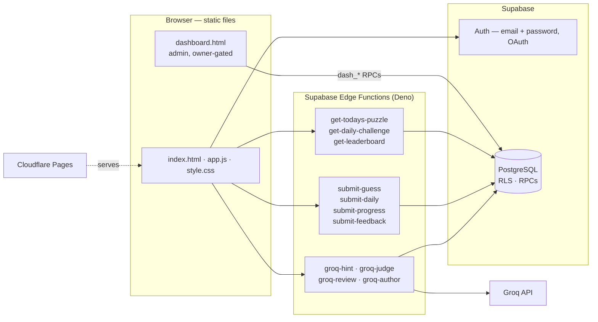
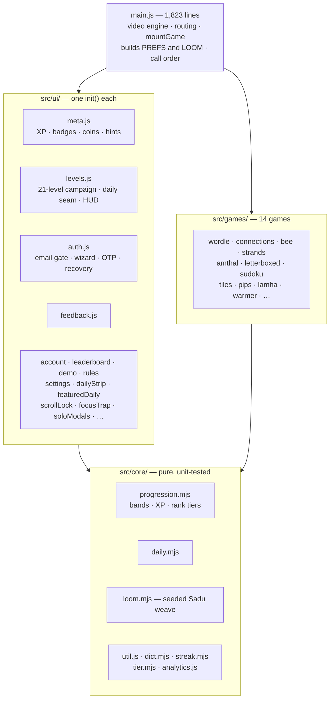
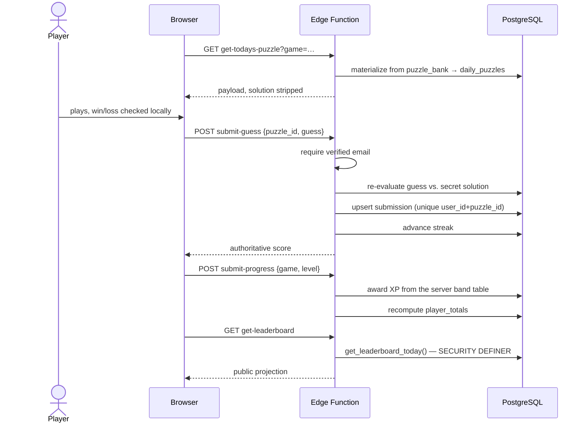
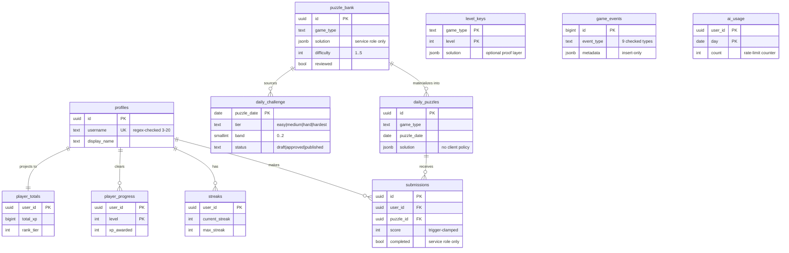

# Sura / سُرى

**[suraio.com](https://suraio.com)** · [العربية](README.ar.md)

An Arabic daily brain-games platform: six live games, a 21-level campaign, a
weekday-graded daily challenge, streaks, a server-authoritative leaderboard,
AI-assisted hints, and an admin analytics dashboard.

Fully right-to-left, no framework, no runtime build step.


| | |
|---|---|
|  |  |

---

## Stack

| Layer | Technology | Notes |
|---|---|---|
| **Frontend** | Vanilla JS (ES modules), HTML, CSS | No framework. `src/` is `core/` + `games/` + `ui/`, bundled to one IIFE. |
| | **esbuild** | `src/main.js` → `app.js`, minified. The bundle is committed; CI fails on drift. |
| | **GSAP + ScrollTrigger** | Scroll-driven camera and card choreography. |
| | **lottie-web** | Lazy-loaded, only where a vector animation is used. |
| | **Canvas 2D** | Procedural Sadu weave backdrop, generated per-day from a seed. |
| **Backend** | **Supabase Edge Functions** (Deno / TypeScript) | 11 functions. All result writes and puzzle reads pass through them. |
| | **Groq** — `llama-3.3-70b-versatile` | Hints, content review, difficulty classification, bank proposals. Never authors a level at play time. |
| | **Resend** | Transactional auth email (verification, recovery). |
| | **Node.js ≥ 20** | Telegram operator bot (service role, not published — see below). |
| **Database** | **PostgreSQL** (Supabase) | **RLS enabled on every table**, no exceptions. |
| | Row Level Security | The authorization layer. Not the frontend, not key secrecy. |
| | `SECURITY DEFINER` RPCs | Leaderboard projection, admin analytics, username claim, AI rate limiter. |
| **Infrastructure** | **Cloudflare Pages** | Static deploy from an explicit whitelist. |
| | **Cloudinary** | Video delivery with `f_auto/q_auto`. |
| | CSP + HSTS via generated `_headers` | SHA-256 hashes computed from the actual inline scripts at build time. |
| **Tooling** | `node:test` | 450 tests, 35 files, **zero install** — Node's built-in runner. |
| | **Playwright** | Headless playthrough sweep and a behavioural fingerprint harness. |
| | **GitHub Actions** | CI (bundle-drift check, lint, tests) and an uptime monitor. |

---

## Architecture



**Trust boundary.** The client is never trusted for results. `submit-guess`
re-evaluates every guess server-side against the secret solution; `submit-progress`
awards XP from the server's own band table, never from a number the client sent.
The Supabase anon key is publishable by design — RLS is what protects the data.

---

## Module structure

`src/main.js` was 7,241 lines in a single `DOMContentLoaded` closure with no
importable surface. It is now 1,823 lines, with 22 modules extracted.



Two rules the split follows: **state is passed, data is imported** (`PREFS` and
`LOOM` are single live instances, so importing their factories would build a
second one that silently never syncs), and **call order is a contract** —
`meta.js` registers what almost everything else reads.

---

## A game round



Anonymous players never post; a signup prompt is offered instead, and their local
progress is migrated on first sign-in.

---

## Data model



`submissions` is unique on `(user_id, puzzle_id)` and `player_progress` on
`(user_id, game_type, level)` — both primary keys double as idempotency keys, so
a retried submission cannot double-credit.

Full detail: [`docs/architecture/database.md`](docs/architecture/database.md).

---

## Engineering highlights

**Behavioural fingerprinting for a refactor with no tests.**
`src/main.js` had 7,241 lines that nothing could import, therefore nothing could
test. Rather than trust a read-through, `scripts/qa/fingerprint.js` drives
Chromium against the running site and records real behaviour — DOM classes, ARIA
state, focus, scroll lock, XP arithmetic, console errors — then diffs it across
the change. The split ran in **10 batches over 22 modules with zero behavioural
drift**, and the one regression that did occur (`escapeHtmlShared is not defined`)
was caught by the harness, not by the suite: every test reads source text, and
only a browser sees an out-of-scope name.

**Closed a leaderboard-forgery hole.** `submissions` carried client `INSERT`/
`UPDATE` RLS policies gated only on `auth.uid() = user_id`, and the integrity
trigger never validated `score` or `completed`. Any signed-in user could POST
directly to `/rest/v1/submissions`, bypass `submit-guess`, and write a perfect
top-of-board entry. Both write policies were dropped and the trigger hardened;
result writes now flow only through the service role. The client had never done
anything but read those tables, so the fix shipped with zero client impact.

**Server-authoritative progression.** `submit-progress` derives XP from the
server's band table, enforces a monotonic gate, is idempotent on its primary key,
and self-heals `player_totals` from `player_progress`.

**Build guards, not conventions.** `scripts/build/dist.js` assembles the deploy
folder from an explicit whitelist, refuses nine extensions, fails on any stray
file, and scans the output for secrets — a file not on the list cannot ship,
wherever it sits. `scripts/build/csp.js` computes CSP hashes from the actual
inline scripts. `scripts/build/preflight.js` rewrites every `?v=` from a content
hash, so cache-busting is never hand-set.

**Tests that were made to fail before being trusted.** 450 tests on Node's
built-in runner, no install step. Where a guard protects something expensive —
the auth module, the security posture — the assertion was mutated in the source
and observed to go red before being kept.

**Offline-first Arabic language layer.** `normalizeArabic` folds tashkeel, alef,
ya and hamza forms, and exists in three implementations — JS, Deno, and a
Postgres function — that a test pins against one canonical spec, because a
divergence would score the same guess two different ways.

---

## Commands

```bash
npm run build        # esbuild → app.js + tallal.js, then preflight, then CSP
npm run dist         # build, then assemble dist/ from an explicit whitelist
npm test             # 450 tests across 35 files
npm run lint         # node --check across 158 first-party files
npm run sweep        # headless playthrough: 21 levels × 6 games
npm run fingerprint  # behavioural baseline — see docs/decisions/0011
npm run publish:tree # assemble the public-repo tree, with guards
```

---

## Repository map

| Path | What |
|---|---|
| `index.html` · `app.js` · `style.css` | The SPA. `app.js` is a committed build artefact — edit `src/`. |
| `src/core/` | Pure, importable, unit-tested logic. |
| `src/games/` | 13 game implementations. |
| `src/ui/` | Cross-cutting UI modules, one `init()` each. |
| `supabase/functions/` | Edge Functions — source of record. |
| `supabase/migrations/` · `supabase/sql/` | Schema, RLS, RPCs. Not interchangeable. |
| `scripts/` | `build/` `bank/` `assets/` `qa/` `promo/`. |
| `tests/` | 35 files, flat — [`tests/README.md`](tests/README.md). |
| `bank/` | Puzzle content (JSON). |

### Not published here

Held back deliberately, and named rather than silently absent. The list is
enforced by `scripts/build/publish.js`, which refuses to assemble the tree if any
of them reappears.

| Withheld | Why |
|---|---|
| `bot.js`, its setup docs | Holds no secrets, but is the service-role writer: it documents the shape of every privileged write and the admin command surface. |
| `dashboard.html`, `dashboard.js` | Hardcodes the owner's email as a gate fallback; enumerates the `dash_*` RPCs. |
| `bank/words_ar.json`, `bank/lexicon_ar.json` | The solution vocabulary. |
| `docs/security/open-findings.md`, `docs/operations/incident-runbook.md` | What is currently weakest, and the order of operations during an incident. Closed findings are published in full. |
| `prompts/`, `migrations_pending.sql`, `docs/historical/final-audit/` | Prompt library, un-applied SQL, and an audit that reads as a roadmap. |

---

## Documentation

| | |
|---|---|
| **Decisions** | [`docs/decisions/`](docs/decisions/) — 11 records, each naming what broke and the number that proved it. Three are failures. |
| **Architecture** | [architecture](docs/architecture/architecture.md) · [database](docs/architecture/database.md) · [repository map](docs/architecture/repository-map.md) · [identity](docs/architecture/identity.md) |
| **Security** | [`SECURITY.md`](SECURITY.md) — reporting a vulnerability · [posture and closed findings](docs/security/security.md) |
| **Operations** | [deployment](docs/operations/deployment.md) · [uptime](docs/operations/uptime.md) · [admin](docs/operations/admin.md) |
| **Performance** | [perf](docs/performance/perf-2026-08.md) · [load test](docs/performance/loadtest-2026-08.md) · [cost](docs/performance/cost-2026-08.md) |

## License

[MIT](LICENSE) © 2026 Khalid Alzahem. The Arabic puzzle content and brand assets
are not covered by it.
